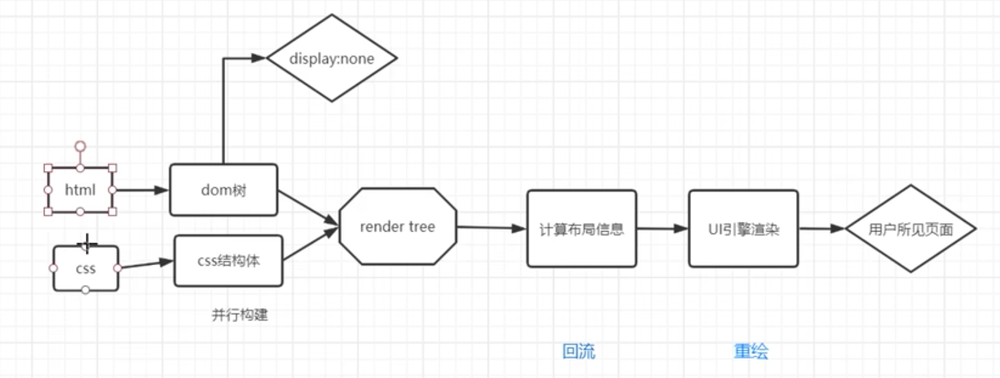
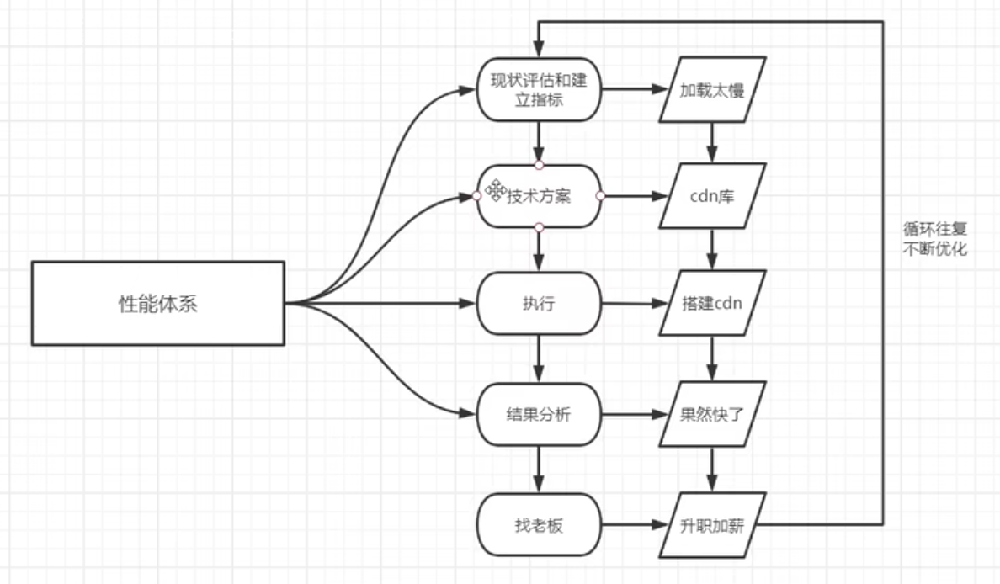

####2022.9.21

* 左右居中
```
marigin:auto
```
* 让一个元素快速居中在页面上
定义类的css
```
<style>
body{
        .eg{
                margin:auto;
        }
        display: flex;
}
</style>
<body>
        <div class="eg">
                <h1/>快速居中
        </div>
</body>
```
* padding 和 margin有什么区别
padding作用于自身，指自身边框到内部另一个容器边框之间的距离，容器内边距
margin作用于外部，指自身边框到另一个容器边框之间的距离，容器外边距  
* vw与百分比的区别
vw不管父级元素，只与屏幕的分辨率有关系
百分比有继承关系

* 行内元素与块级元素的区别
span行内元素：宽度设置不管用，宽高由内容决定
div块级元素：宽高有继承关系，且独占一行

* 如何让谷歌支持小字体
```
.eg{
        transform: scale(0.8)//变到原来的0.8倍
}
```

* let 和 var (不要用var，容易污染变量)
  * 声明提升（先上车后补票）
  ```
  console.log(name);//会输出test
  var name = "test";
  ```
  * 没有局部作用域（红杏出墙）
  ```
  function f(){
          for(var i = 0; i<4 ; i++)
          {}
          console.log(i);//输出5
  }
  f()
  ```
  * 声明覆盖（套牌车）
  ```
  var name = "test1";
  var name = "test2";
  console.log(name);\\会输出test2
  ```

* 深浅拷贝（深不影响）
  1. 基本数据类型，属于赋值，深拷贝
  ```
  let a = 1;
  let b = 2;
  console.log(a,b);//输出1，2
  ```
  2. 引用数据类型（对象，数组），属于浅拷贝


####2022.9.24

* 输入URL的瞬间干了什么？
www.baidu.com：URL=>统一资源定位符号 
URL是IP的映射
www：服务器
https：超文本传输协议（http和TCP之间加了TLS或者SSL的安全层）
baidu.com：域名
  * 第一次访问这个URL
  输入URL->DNS域名系统里存储的IP->拿到真实IP->TCP三次握手建立连接->拿数据，渲染页面->四次挥手断开连接
    * 如何渲染
      
  * 第n次访问这个URL
    浏览器将域名解析的IP储存在本地，首先读取浏览器缓存，查看存储的IP是否过期了……
* 从哪些点做性能优化
  * 加载
    * 减少http请求（精灵图，文件合并）
    * 减小文件大小（资源压缩，图片压缩，代码压缩）
    * CDN（第三方库）：图片交给第三方上传，只需要链接引入
    * 预加载，SSR服务端渲染
    * 懒加载
    * 分包：加快主页加载
  * 减少dom操作，避免回流，文档碎片
* 浏览器底层性能优化
  * 页面加载性能：加载时间，用户体验
  * 动画与操作性能：是否流畅无卡顿
  * 内存占用：内存过大， 浏览器崩掉
  * 电量消耗
  


